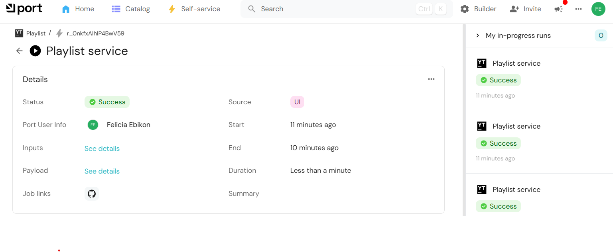
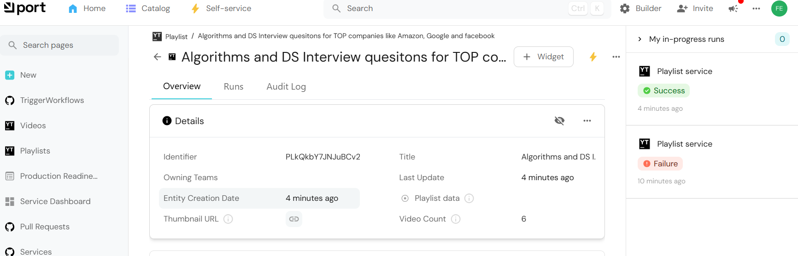
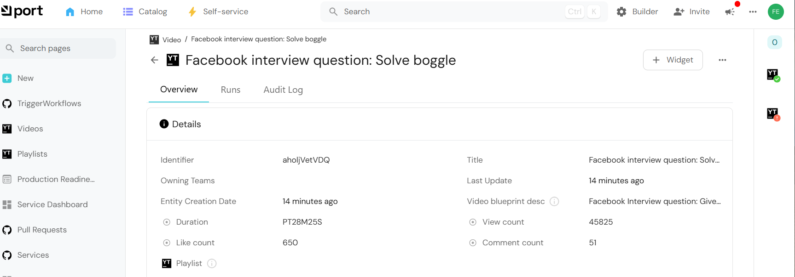
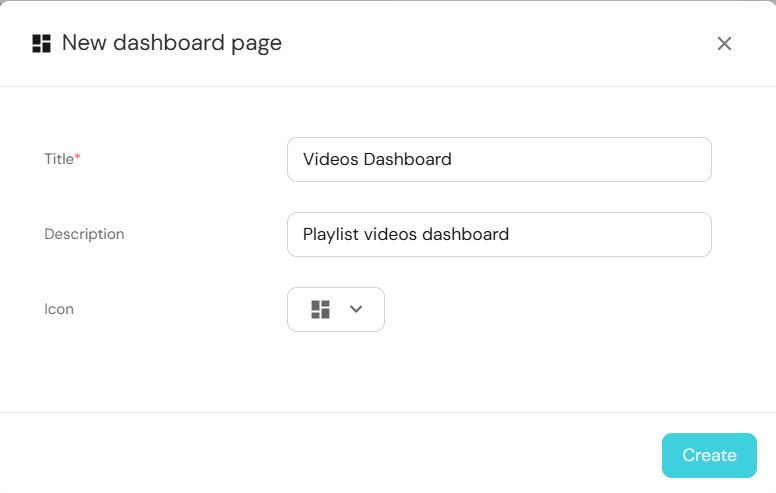
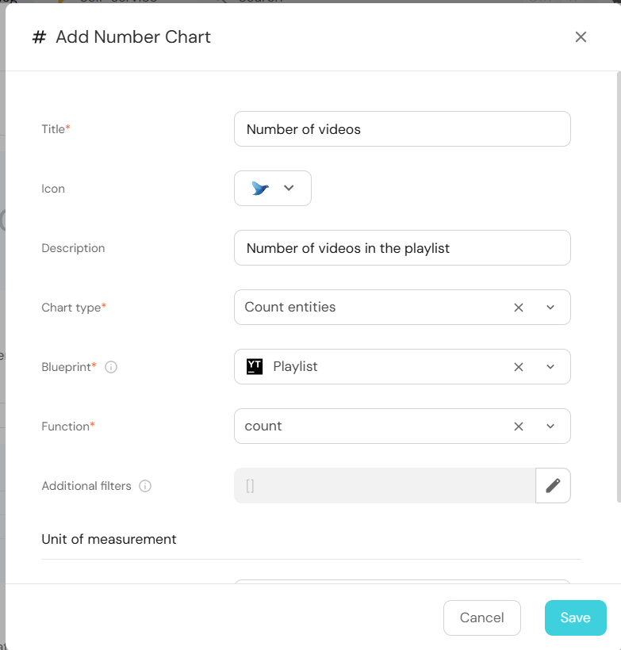
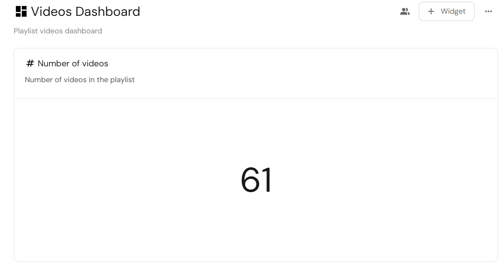
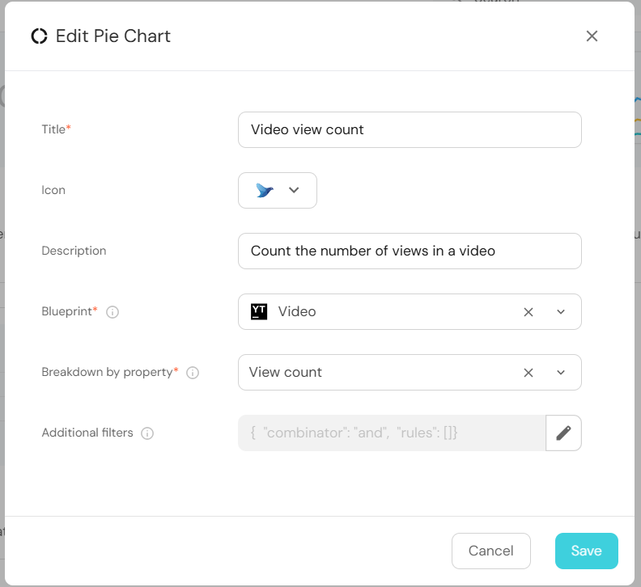
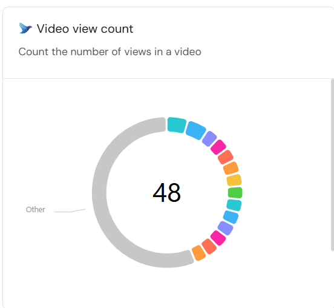

# Ingesting YouTube playlist and videos in Port

In this guide, we will demonstrate how to efficiently manage and visualize data from a YouTube playlist, providing quick insights into your video content. 
By following this guide, you'll learn how to ingest your YouTube data into Port.

## Prerequisites
 - GitHub Account 
 - You have a Port account and have completed the [onboarding process](https://docs.getport.io/quickstart) 
 - Youtube Playlist ID
 - Youtube data API key. [Get your Youtube API key](https://blog.hubspot.com/website/how-to-get-youtube-api-key)

## Data modeling
The first step is to define a model for the YouTube playlist and videos in Port. This involves creating **blueprints** for the playlist and video, defining their properties, and establishing relationships.

### Create Blueprints

  - Log in to Port and click on [Builder](https://app.getport.io/settings/data-model)
  - Then click on the `+ Blueprint` button
  - Click on `Edit JSON`

Add the JSON snippet below to create the playlist blueprint

<details>
  <summary><b>Playlist blueprint (click to expand)</b></summary>
  
  ```json showLineNumber
  {
    "identifier": "playlist",
    "description": "A YouTube playlist",
    "title": "Playlist",
    "icon": "Youtrack",
    "schema": {
      "properties": {
        "description": {
          "icon": "DefaultProperty",
          "type": "string",
          "title": "Playlist data",
          "description": "This is playlist blueprint description"
        },
        "thumbnail_url": {
          "type": "string",
          "title": "Thumbnail URL",
          "description": "Thumbnail URL",
          "format": "url"
        },
        "video_count": {
          "type": "number",
          "title": "Video Count",
          "description": "Number of videos in the playlist"
        }
      },
      "required": []
    },
    "mirrorProperties": {},
    "calculationProperties": {},
    "aggregationProperties": {},
    "relations": {}
  }
  ```
</details>

Add the snippet below to create the video blueprint:

<details>
  <summary><b> Video blueprint (click to expand)</b></summary>

  ```json showLineNumber
  {
    "identifier": "video",
    "description": "YouTube videos in a playlist",
    "title": "Video",
    "icon": "Youtrack",
    "schema": {
      "properties": {
        "description": {
          "type": "string",
          "title": "Video blueprint desc",
          "description": "Video blueprint description "
        },
        "duration": {
          "icon": "DefaultProperty",
          "type": "string",
          "title": "Duration"
        },
        "view_count": {
          "icon": "DefaultProperty",
          "type": "number",
          "title": "View count"
        },
        "like_count": {
          "icon": "DefaultProperty",
          "type": "number",
          "title": "Like count"
        },
        "comment_count": {
          "icon": "DefaultProperty",
          "type": "number",
          "title": "Comment count"
        }
      },
      "required": []
    },
    "mirrorProperties": {},
    "calculationProperties": {},
    "aggregationProperties": {},
    "relations": {
      "playlist": {
        "title": "Playlist",
        "description": "Playlist",
        "target": "playlist",
        "required": false,
        "many": false
      }
    }
  }
  ```
</details>

## Ingest Youtube data
To fetch and ingest YouTube playlist data into Port, we'll use Port's REST API integrated within a GitHub Actions.

Follow the steps below:

1. Create a yaml file in your Github repository under .github/workflows 
2. Copy and paste the workflow below

:::info Save credentials

Create the following GitHub secrets:

- **PORT_CLIENT_ID**: Your Port client ID
- **PORT_CLIENT_SECRET**: Your Port client secret
- **YOUTUBE_API_KEY**: Your YouTube Data API key

:::


<details>
  <summary><b>Workflow yaml (Click to expand)</b></summary>

  ```yaml
  name: YouTube Playlist to Port Ingestion

  on:
    workflow_dispatch:
      inputs:
        playlist_id:
          description: "Youtube video playlist id"
          required: true
        port_context:
          description: "Includes the blueprint identifier, and the action's run id"
          type: string
          required: true
  
  jobs:
    create-playlist:
      runs-on: ubuntu-latest
      outputs:
        playlist_title: ${{ steps.playlist_info.outputs.title }}
        playlist_count: ${{ steps.playlist_info.outputs.count }}
      steps:
        - name: Get Port Token
          id: get_token
          env:
            PORT_CLIENT_ID: ${{ secrets.PORT_CLIENT_ID }}
            PORT_CLIENT_SECRET: ${{ secrets.PORT_CLIENT_SECRET }}
          run: |
            set -e
            TOKEN_RESPONSE=$(curl -s -X POST "https://api.getport.io/v1/auth/access_token" \
              -H "Content-Type: application/json" \
              -d "{\"clientId\": \"$PORT_CLIENT_ID\", \"clientSecret\": \"$PORT_CLIENT_SECRET\"}")
            
            ACCESS_TOKEN=$(echo "$TOKEN_RESPONSE" | jq -r '.accessToken')
            if [ -z "$ACCESS_TOKEN" ] || [ "$ACCESS_TOKEN" = "null" ]; then
              echo "::error::Failed to get access token"
              exit 1
            fi
            echo "ACCESS_TOKEN=$ACCESS_TOKEN" >> $GITHUB_ENV
  
        - name: Get Playlist Info and Create Port Entity
          id: playlist_info
          env:
            YOUTUBE_API_KEY: ${{ secrets.YOUTUBE_API_KEY }}
            PLAYLIST_ID: ${{ github.event.inputs.playlist_id }}
            PORT_CONTEXT: ${{ inputs.port_context }}
          run: |
            set -e
            echo "::group::Fetching playlist data"
            PLAYLIST_DATA=$(curl -s "https://youtube.googleapis.com/youtube/v3/playlists?part=snippet,contentDetails&id=${PLAYLIST_ID}&key=${YOUTUBE_API_KEY}")
            
            if [ "$(echo $PLAYLIST_DATA | jq '.items | length')" -eq 0 ]; then
              echo "::error::No playlist found"
              exit 1
            fi
  
            title=$(echo $PLAYLIST_DATA | jq -r '.items[0].snippet.title')
            description=$(echo $PLAYLIST_DATA | jq -r '.items[0].snippet.description')
            thumbnail=$(echo $PLAYLIST_DATA | jq -r '.items[0].snippet.thumbnails.default.url')
            count=$(echo $PLAYLIST_DATA | jq -r '.items[0].contentDetails.itemCount')
  
            PLAYLIST_PAYLOAD=$(jq -n \
              --arg id "$PLAYLIST_ID" \
              --arg title "$title" \
              --arg desc "$description" \
              --arg thumb "$thumbnail" \
              --arg count "$count" \
              '{
                identifier: $id,
                title: $title,
                properties: {
                  description: $desc,
                  thumbnail_url: $thumb,
                  video_count: ($count|tonumber)
                }
              }')
  
            echo "::group::Creating playlist entity"
            RESPONSE=$(curl -s -X POST "https://api.getport.io/v1/blueprints/playlist/entities" \
              -H "Authorization: Bearer $ACCESS_TOKEN" \
              -H "Content-Type: application/json" \
              -d "$PLAYLIST_PAYLOAD")
  
            if [ "$(echo "$RESPONSE" | jq -r '.ok // false')" != "true" ]; then
              echo "::error::Failed to create playlist entity: $(echo "$RESPONSE" | jq -r '.message')"
              exit 1
            fi
            echo "::endgroup::"
  
            echo "title=$(echo "$title" | jq -R -s .)" >> $GITHUB_OUTPUT
            echo "count=$count" >> $GITHUB_OUTPUT
  
    process-videos:
      needs: create-playlist
      runs-on: ubuntu-latest
      steps:
        - name: Get Port Token
          id: get_token
          env:
            PORT_CLIENT_ID: ${{ secrets.PORT_CLIENT_ID }}
            PORT_CLIENT_SECRET: ${{ secrets.PORT_CLIENT_SECRET }}
          run: |
            set -e
            TOKEN_RESPONSE=$(curl -s -X POST "https://api.getport.io/v1/auth/access_token" \
              -H "Content-Type: application/json" \
              -d "{\"clientId\": \"$PORT_CLIENT_ID\", \"clientSecret\": \"$PORT_CLIENT_SECRET\"}")
            
            ACCESS_TOKEN=$(echo "$TOKEN_RESPONSE" | jq -r '.accessToken')
            if [ -z "$ACCESS_TOKEN" ] || [ "$ACCESS_TOKEN" = "null" ]; then
              echo "::error::Failed to get access token"
              exit 1
            fi
            echo "ACCESS_TOKEN=$ACCESS_TOKEN" >> $GITHUB_ENV
  
        - name: Process Videos
          env:
            YOUTUBE_API_KEY: ${{ secrets.YOUTUBE_API_KEY }}
            PLAYLIST_ID: ${{ github.event.inputs.playlist_id }}
            PORT_CONTEXT: ${{ inputs.port_context }}
            PLAYLIST_TITLE: ${{ needs.create-playlist.outputs.playlist_title }}
          run: |
            set -e
            # Extract run ID
            RUN_ID=$(echo "$PORT_CONTEXT" | jq -r --raw-input 'fromjson | .runId')
            if [ -z "$RUN_ID" ]; then
              echo "::error::Failed to get run ID from context"
              exit 1
            fi
  
            # Initialize counters in a temp file for persistence across subshells
            echo "0" > /tmp/videos_processed
            echo "0" > /tmp/videos_failed
  
            # Function to add logs to the action run
            add_action_log() {
              local MESSAGE=$1
              local STATUS_LABEL=${2:-""}
  
              # Send log without checking status
              local PAYLOAD="{\"message\": \"$MESSAGE\""
              if [ -n "$STATUS_LABEL" ]; then
                PAYLOAD="$PAYLOAD, \"statusLabel\": \"$STATUS_LABEL\""
              fi
              PAYLOAD="$PAYLOAD}"
  
              curl -s -X POST "https://api.getport.io/v1/actions/runs/$RUN_ID/logs" \
                -H "Authorization: Bearer $ACCESS_TOKEN" \
                -H "Content-Type: application/json" \
                -d "$PAYLOAD"
            }
  
            # Function to update final action status only
            update_final_status() {
              local STATUS=$1
              local SUMMARY=$2
              local DETAILS=$3
  
              curl -s -X PATCH "https://api.getport.io/v1/actions/runs/$RUN_ID" \
                -H "Authorization: Bearer $ACCESS_TOKEN" \
                -H "Content-Type: application/json" \
                -d "{
                  \"status\": \"$STATUS\",
                  \"message\": {
                    \"summary\": \"$SUMMARY\",
                    \"details\": \"$DETAILS\"
                  }
                }"
            }
  
            # Function to create video entity
            create_video_entity() {
              local BLUEPRINT=$1
              local PAYLOAD=$2
              curl -s -X POST "https://api.getport.io/v1/blueprints/${BLUEPRINT}/entities" \
                -H "Authorization: Bearer $ACCESS_TOKEN" \
                -H "Content-Type: application/json" \
                -d "$PAYLOAD"
            }
  
            # Function to process videos
            process_videos() {
              local PAGE_TOKEN=$1
              local API_URL="https://youtube.googleapis.com/youtube/v3/playlistItems?part=contentDetails&maxResults=50&playlistId=${PLAYLIST_ID}&key=${YOUTUBE_API_KEY}"
              if [ -n "${PAGE_TOKEN}" ]; then
                API_URL="${API_URL}&pageToken=${PAGE_TOKEN}"
              fi
  
              add_action_log "Fetching videos from playlist..." "Fetching"
              local ITEMS_RESPONSE=$(curl -s "${API_URL}")
              
              echo "$ITEMS_RESPONSE" | jq -r '.items[].contentDetails.videoId' | while read -r VIDEO_ID; do
                add_action_log "Processing video: ${VIDEO_ID}" "Processing"
                
                VIDEO_DATA=$(curl -s "https://youtube.googleapis.com/youtube/v3/videos?part=snippet,contentDetails,statistics&id=${VIDEO_ID}&key=${YOUTUBE_API_KEY}")
                
                if [ "$(echo "$VIDEO_DATA" | jq '.items | length')" -gt 0 ]; then
                  local title=$(echo "$VIDEO_DATA" | jq -r '.items[0].snippet.title')
                  local description=$(echo "$VIDEO_DATA" | jq -r '.items[0].snippet.description')
                  local thumbnail=$(echo "$VIDEO_DATA" | jq -r '.items[0].snippet.thumbnails.default.url')
                  local duration=$(echo "$VIDEO_DATA" | jq -r '.items[0].contentDetails.duration')
                  local view_count=$(echo "$VIDEO_DATA" | jq -r '.items[0].statistics.viewCount // "0"')
                  local like_count=$(echo "$VIDEO_DATA" | jq -r '.items[0].statistics.likeCount // "0"')
                  local comment_count=$(echo "$VIDEO_DATA" | jq -r '.items[0].statistics.commentCount // "0"')
                  
  
                  add_action_log "Found video: $title" "Found"
  
                  VIDEO_PAYLOAD=$(jq -n \
                    --arg id "$VIDEO_ID" \
                    --arg title "$title" \
                    --arg desc "$description" \
                    --arg thumb "$thumbnail" \
                    --arg duration "$duration" \
                    --arg views "$view_count" \
                    --arg likes "$like_count" \
                    --arg comments "$comment_count" \
                    --arg playlist_id "$PLAYLIST_ID" \
                    '{
                      identifier: $id,
                      title: $title,
                      properties: {
                        description: $desc,
                        thumbnail_url: $thumb,
                        duration: $duration,
                        view_count: ($views|tonumber),
                        like_count: ($likes|tonumber),
                        comment_count: ($comments|tonumber)
                      },
                      relations: {
                        
                      }
                    }')
  
                  RESPONSE=$(create_video_entity "video" "$VIDEO_PAYLOAD")
                  if [ "$(echo "$RESPONSE" | jq -r '.ok // false')" = "true" ]; then
                    CURRENT=$(cat /tmp/videos_processed)
                    echo $((CURRENT + 1)) > /tmp/videos_processed
                    add_action_log "Successfully processed video: $title" "Success"
                  else
                    CURRENT=$(cat /tmp/videos_failed)
                    echo $((CURRENT + 1)) > /tmp/videos_failed
                    add_action_log "Failed to process video: $(echo "$RESPONSE" | jq -r '.message')" "Failed"
                  fi
  
                  # Progress update without status change
                  PROCESSED=$(cat /tmp/videos_processed)
                  FAILED=$(cat /tmp/videos_failed)
                  if [ $((PROCESSED % 5)) -eq 0 ]; then
                    add_action_log "Progress: Processed ${PROCESSED} videos, ${FAILED} failed" "Progress"
                  fi
  
                  sleep 1
                else
                  CURRENT=$(cat /tmp/videos_failed)
                  echo $((CURRENT + 1)) > /tmp/videos_failed
                  add_action_log "No data found for video: $VIDEO_ID" "Not Found"
                fi
              done
  
              # Check for next page
              NEXT_PAGE=$(echo "$ITEMS_RESPONSE" | jq -r '.nextPageToken // empty')
              if [ -n "$NEXT_PAGE" ]; then
                add_action_log "Fetching next page of videos..." "Next Page"
                process_videos "$NEXT_PAGE"
              fi
            }
  
            # Start processing
            add_action_log "Starting video processing for playlist: $PLAYLIST_TITLE" "Starting"
            process_videos ""
  
            # Final status update
            PROCESSED=$(cat /tmp/videos_processed)
            FAILED=$(cat /tmp/videos_failed)
            
            FINAL_DETAILS="Processed ${PROCESSED} videos, ${FAILED} failed"
            add_action_log "$FINAL_DETAILS" "Completed"
            
            if [ "$PROCESSED" -gt 0 ]; then
              update_final_status "SUCCESS" "Processing complete" "$FINAL_DETAILS"
            else
              update_final_status "FAILURE" "No videos processed" "$FINAL_DETAILS"
              exit 1
            fi
  
        - name: Report Failure
          if: failure()
          env:
            PORT_CONTEXT: ${{ inputs.port_context }}
          run: |
            set -e
            RUN_ID=$(echo "$PORT_CONTEXT" | jq -r --raw-input 'fromjson | .runId')
            
            curl -s -X PATCH "https://api.getport.io/v1/actions/runs/$RUN_ID" \
              -H "Authorization: Bearer $ACCESS_TOKEN" \
              -H "Content-Type: application/json" \
              -d '{
                "status": "FAILURE",
                "message": {
                  "summary": "Workflow failed",
                  "details": "Check logs for details"
                }
              }'
     
  ```
</details>


## Create Self Service 
We'll create a self service to trigger the workflow to run from Port. We will start by creating an action that triggers the playlist GitHub workflow.

**To create the action:**

:::info Edit credentials

Replace
- **org**: With your GitHub organization name
- **repo**: With your repository name
- **workflow**: With your workflow name

:::

1. Log in to Port and click on the **Self-service** tab.
2. Click on `+ Action` button.
3. Click on `Edit JSON`.
4. Copy and paste the JSON below
5. Click Save


<details>
    <summary><b>Action JSON (Click to expand)</b></summary>

   ```json showLineNumber
   {
     "identifier": "playlist_service",
     "title": "Playlist service",
     "description": "This is the action to trigger playlist workflow",
     "trigger": {
       "type": "self-service",
       "operation": "CREATE",
       "userInputs": {
         "properties": {
           "playlist_id": {
             "icon": "DefaultProperty",
             "type": "string",
             "title": "Playlist Id",
             "description": "Youtube playlist id"
           }
         },
         "required": [
           "playlist_id"
         ],
         "order": [
           "playlist_id"
         ]
       },
       "blueprintIdentifier": "playlist"
     },
     "invocationMethod": {
       "type": "GITHUB",
       "org": "<Your organization name>",
       "repo": "<Your repository name>",
       "workflow": "Your workflow name>",
       "workflowInputs": {
         "{{ spreadValue() }}": "{{ .inputs }}",
         "port_context": {
           "runId": "{{ .run.id }}",
           "blueprint": "{{ .action.blueprint }}"
         }
       },
       "reportWorkflowStatus": true
     },
     "requiredApproval": false
   }
   ```
</details>

- **`reportWorkflowStatus`** allows Port to report the workflow status back to the Port dashboard.

### **Trigger the Action**

To execute the action:
  1. Open the **Self-service** tab in Port.
  2. Select **Playlist service**.
  3. Enter your playlist ID (e.g., `PL-7fHWfrqQvEUgrFz5pE-NWd6-8ixbX8w`)
  4. Click `Execute`, and the GitHub workflow will run automatically.

You can view the status of the action by clicking on the progress icon, and then the service name at the top right corner on the page.
It should look similar to the image below 



**If Self service action is `Successful`**
Navigate to Catalog and click on Playlist to view your playlist data, it should look similar to the image below



Also, navigate to Catalog and click on Video to view your videos, it should look similar to the image below




## Visualization

Let's visualize our YouTube data in Port by defining key metrics like view counts, and number of videos in the playlist.

### Setup
   1. Log in to Port and click on Catalog.
   2. Click on the `+ New` button in the left sidebar.
   3. Select `New dashboard`.
   4. On Title: Type **Videos dashboard**
   5. On Description: Type **Playlist videos dashboard**
   6. Choose an icon if desired, or leave as default
   7. Click Create.



**This will create a new empty dashboard.**

### Adding widgets
We'll create two widgets to display the number of videos in the playlist and count the number of views a video has.

#### Videos Count
Let's display the number of videos in the playlist using a number chart

   1. Click `+ Widget` and select Number Chart.
   2. Title: Type **Number of videos**
   3. Icon: Choose an icon of your choice
   4. Description: Type **Number of videos in the playlist**
   5. Chart type: Select **Count entities**
   6. Blueprint: Select **Playlist**
   7. Function: Select **count**
   8. Leave the rest as default
   9. Click Save.







#### Views Count
Let's display the number of views in a video by using a Pie chart 


   1. Click `+ Widget` and select Pie Chart.
   2. Title: Type **Video view count**
   3. Icon: Choose an icon of your choice
   4. Description: Type **Count the number of views in a video**
   5. Blueprint: Select **Video**
   6. Breakdown by property: Select **View count**
   7. Leave the rest as default
   8. Click Save.







## Conclusion
With this guide, you now know how to fetch and ingest YouTube playlist and it contents into Port, create self service and visualize the data. 
